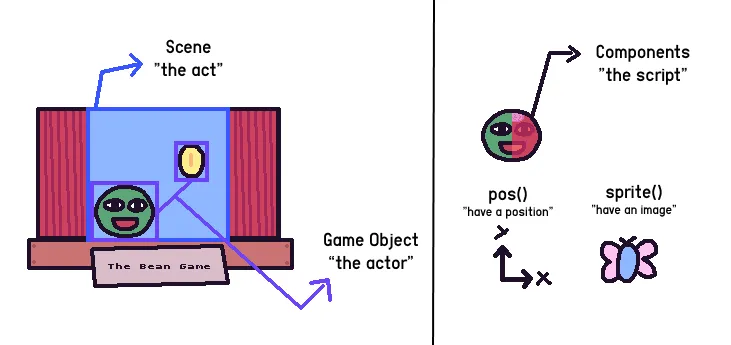

# KAPLAY

Dette repo forsøger at forklare, hvordan man kommer i gang med at bygge spil med KAPLAY.

## Hvad er 'KAPLAY'?

KAPLAY er et JavaScript og TypeScript bibliotek, som gør det nemt at lave spil i browseren.

Læs om KAPLAY her: https://kaplayjs.com/

## Hvordan kommer man i gang med 'KAPLAY'?

Den nemmeste måde man kan komme i gang med at lave spil i KAPLAY er at have Node.js installeret, og derigennem gøre brug af et CLI (dvs. et 'command line interface'), som automatisk sætter et KAPLAY projekt op for en.

Download derfor først Node.js via:

- [Node.js](https://nodejs.org/en)

### Skab et KAPLAY projekt

Når man har fået Node.js installeret, så kan man blot fra kommandolinjen/terminalen kører følgende kommand, hvilket vil skabe et nyt KAPLAY projekt i en ny folder med det navn man angiver (her er navnet 'mygame' valgt):

```bash
npx create-kaplay mygame
```

### Kør KAPLAY projektet

Efter at ens projekt er skabt, så kan man blot bruge følgende kommandoer til at starte og se ens spil i browseren, da sidste kommando vil give et link til ens browser, hvorfra man kan se starten på ens spil:

```bash
cd mygame
npm run dev
```

Kører man således disse kommandoer, så skulle man i ens kommandolinje gerne få et link a la <code>http://localhost:3001/</code>, som, hvis man følger linket, gerne skulle vise noget a la det her i ens browser:


## Kort gennemgang af et KAPLAY projekt

Når ens KAPLAY projekt er skabt på ovenstående måde, så vil det have følgende mappe- og filstruktur:

```bash
├── node_modules
├── public
├── src
├── README.md
├── index.html
├── package-lock.json
├── package.json
└── vite.config.js
```

Og den fil hvorudfra man starter programmeringen af ens spil findes i <code>main.js</code> filen, som ligger under <code>src</code> mappen, dvs. her:

```bash
└── src
    └── main.js
```

## Kort gennemgang af et KAPLAY spils byggesten

KAPLAY er overordnet set bygget op af 4 koncepter:

1. Scenes
2. Game objects
3. Components
4. Events

Når man koder et spil i KAPLAY, så kan man tænke på ens spil lidt som et teater: 'scenes' er akterne, 'game objects' er skuespillerne, 'components' er det manuskript skuespillerne følger, og 'events' er de ting som sker undervejs i spillet, for skuespillerne osv.

Fra KAPLAY's [dokumentation](https://kaplayjs.com/guides/starting/) giver dette billede et ganske godt overblik over koncepterne:



### Scenes

Scener er det, der omslutter 'game objects' - scenens handlinger.

Typiske scener kan fx omfatte en hovedmenu, selve spillet og en 'game over' scene.

### Game objects

'Game objects' er den grundlæggende enhed i KAPLAY. Spilleren, en sommerfugl, et træ eller endda et stykke tekst er alle spilobjekter. De er så at sige 'skuespillerne', som bevæger sig, interagerer og gør spillet interessant.

### Components

'Components' er byggestenene i 'Game objects'. De definerer 'Game objects' adfærd, som hvordan det bevæger sig, ser ud og interagerer med andre objekter.

### Events

'Events' er specifikke øjeblikke i dit spil, hvor du kan håndtere og eksekvere kode, når et (specifikt) 'event' sker.

Et 'event' kan fx være, når en spiller trykker på "space" på sit keyboard, til hvilket man så kan eksekvere noget kode, når det sker.

## Gennemgang af kodning af et simpelt spil

I det følgende gives en gennemgang af, hvordan man selv koder et (meget, meget, meget) simpelt spil med KAPLAY.

### Skab dit spil

Som beskrevet ovenfor er første step - når altså du har fået [Node.js](https://nodejs.org/en) installeret - at køre denne kommando til at sætte dit KAPLAY spilprojekt op:

```bash
npx create-kaplay mygame
```

### Start dit spilprojekt

Og når denne kommando har skabt ens spilprojekt, så skulle man som beskrevet blot køre disse kommandoer for at starte ens spil:

```bash
cd mygame
npm run dev
```

Herefter kan man så blot følge det link man får givet i ens terminal - som udgangspunkt vil det formentlig være <code>http://localhost:3001/</code> - og se udgangspunktet for ens spil i sin browser.

### Importer 'kaplay' i 'src/main.js'

Når man skal starte med at kode et simpelt spil som dette, at man åbner sin <code>main.js</code> fil under <code>src</code> mappen og importerer <code>kaplay</code> i toppen af denne.

Det gøres sådan her i toppen af filen:

```javascript
import kaplay from "kaplay";
```

### Initialiser 'kaplay'

Efter at 'kaplay' er importeret i toppen af ens <code>main.js</code> fil, så er det første man i et hvert KAPLAY spil skal gøre, at initialisere KAPLAY i spil.

Det gøres sådan her i ens kode (dvs. under 'kaplay' importen):

```javascript
const k = kaplay();
```

### Load 'sprites' (game objects)

Dernæst er det næste man gør (som oftest før alt andet), at loade ens 'game objects'.

Det gør man vhja. <code>loadSprite()</code> metoden, hvor vi her blot vil loade <code>bean.png</code> billedet som ét af vores 'game objects', hvilken man automatisk bliver givet under <code>public/sprites/</code> mappen, når skaber et KAPLAY projekt som gjort ovenfor.

Under initialisering af 'kaplay' skriver man således følgende for at loade ens 'game object':

```javascript
k.loadSprite("bean", "sprites/bean.png");
```

### Skab en 'Scene'

Når ens 'game objects' således er loadet, så er det næste i processen, at man laver en 'Scene' til sit spil.

Dette gøres ved at kalde <code>scene()</code> metoden efter al foregående kode sådan her:

```javascript
k.scene("game", () => {
  // Det er her vi om lidt vil tilføje vores 'game objects'
});
```

Og her er det vi gør, at vi først giver vores scene et navn - her kaldet <code>"game"</code> - og dernæst angiver en funktion, som er den der kaldes, når vi senere starter vores <code>game</code> scene.

### Tilføj et 'Game object'

Nu vi har vores <code>game</code> scene sat op, så er det næste vi skal gøre, at tilføje et 'game object' til vores scene.

Det gør man ved at kalde <code>add</code> metoden inde under vores <code>game</code> scenes funktion på denne måde:

```javascript
k.scene("game", () => {
  k.add([
    // Det her vi om lidt vil tilføje 'components' til dette 'game object', således at dette reelt kommer til senere at blive vist på skærmen
  ]);
});
```

### Tilføj 'Components'

For at vores 'Game object' overhovedet kommer til at blive vist - hvilket det gøres når vi til allersidst bruger en metode til at få vist vores <code>game</code> scene - så skal vi til vores 'Game object' tilknytte nogle 'Components'.

Til vores 'Game object' vil vi her først blot tilføje det <code>bean.png</code> billede vi tidligere loaded, samt angive en position på skærmen, hvor vores 'Game object' (her <code>bean.png</code> billedet) vil blive vist.

Og dette gør vi ved at kalde både <code>sprite()</code> og <code>pos()</code> metoderne imellem 'tuborgklammerne' <code>[]</code> for det førtilknyttede 'Game object' sådan her:

```javascript
k.scene("game", () => {
  k.add([
    k.sprite("bean")]),
    k.pos(120, 80),
});
```

Med dette angiver vi således, at 'Components' til vores 'Game objects' er billede, som skal vises på koordinatorne x = 120 og y = 80 på skærmen.

> _For spil som dette positioneres 'x' koordinaten i øvrigt fra toppen af ens browservindues venstre øverste hjørne og mod samme i højre side, mens 'y' koordinaten går fra venstre øverste hjørne og nedad._

### Tilføj et 'Event'

Til dette super simple spil vil blot tilføje et 'Event', hvor der vises et animeret billede med teksten "Kaboom", når spiller trykker på sin laptops "mousepad".

Og det gør vi ved at kalde <code>onClick()</code> funktionen lige efter netop tilføjede 'Component', inde imellem 'tuborgklammerne' <code>[]</code> for vores 'Game object' sådan her:

```javascript
k.scene("game", () => {
  k.add([k.pos(120, 80), k.sprite("bean")]);
  k.onClick(() => k.addKaboom(k.mousePos()));
});
```

### Start 'game' scenen
Eneste der nu blot mangler for at få startet og vist dette simple spil i browserne er, at vi sætter vores spil op til at vise 'game' scenen, når spillet starter.

Og dette gøres meget enkelt ved at kalde <code>go()</code> funktionen allernederst i vores kode (dvs. her under koden til vores 'scene'), hvor vi blot skal angive navnet på vores 'scene' for at få denne, og spillets logik, vist og eksekveret i browseren.

Ergo kalder vi altså bare <code>go</code> funktionen som følger, hvorefter man skal spille sit spil i ens browser:

```javascript
k.go("game");
```

### Resultatet
Med denne kode vil ens spil således tage sig sådan her ud i ens browser:

[]